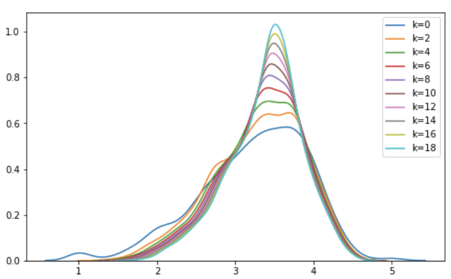
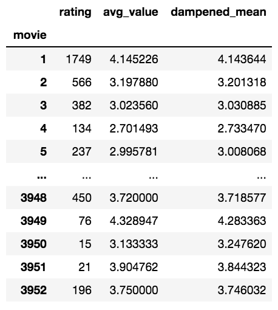
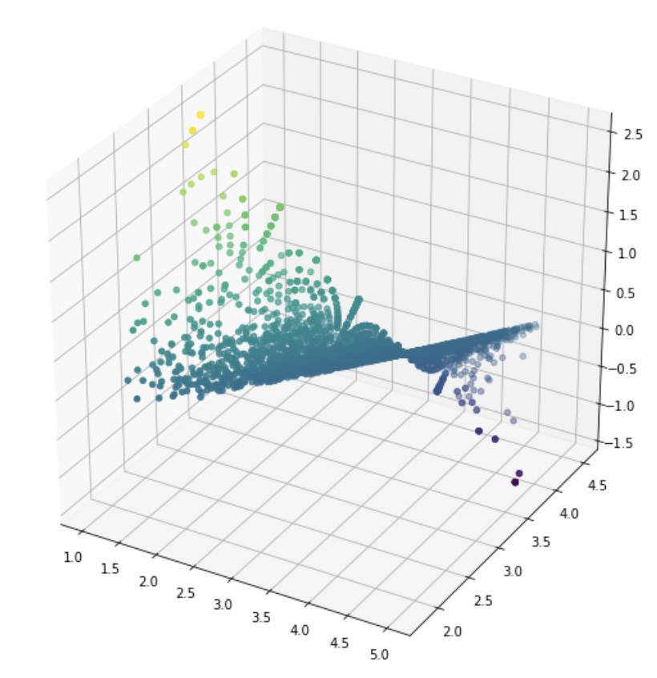
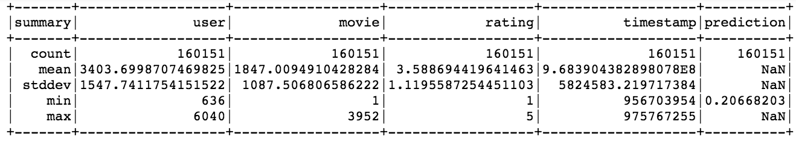
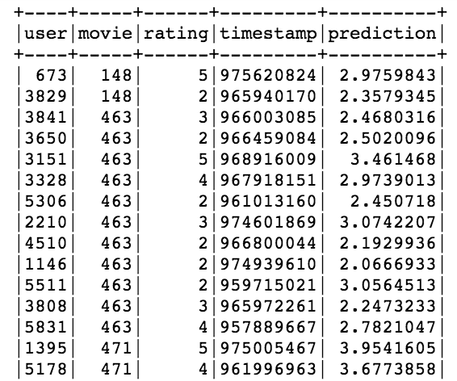
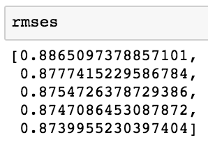
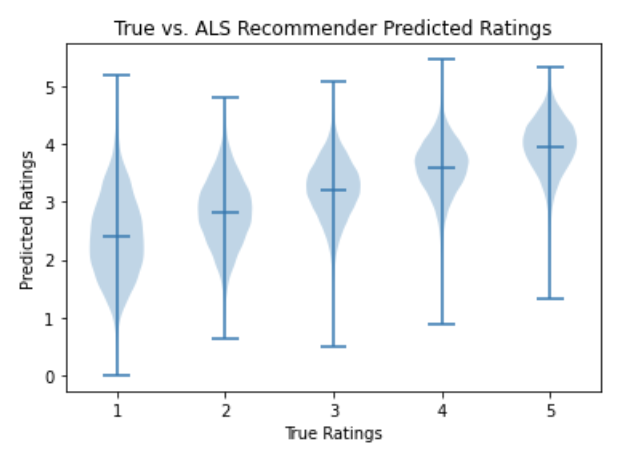

# Watch Better Movies Incorporated 

#### presented by Andrew Means and Jacob Hei

# Abstract
Tired of scrolling to infinity? So were we.  That is, until we developed a movie recommendation model capable of accurately predicting a given user's rating for a new movie based on past ratings, as well as the capability to handle the cold start problem of new movies or new users who have not yet rated movies.  This repository will go through rating prediction methods and accuracy for content-based, similarity-based, and matrix factorized models and display a given user's top 5% rated movies.  

# Overview
 - Understanding the data
 - first simple model
 - Graphing
 - matrix facorization
 - random forest model
  

 

# EDA
Datasets used in building the model
1) training set of 800,000 instances of movie ratings from ___ users on ___ movies
2) movie database with genre description tags
3) kaggle database with tfidf vectorized plot description words

1

Dampend mean plot

# Item-item Similarity Model
To explore how our more complex models captured the signal from the noise we needed an initial model to compare it to.  Item-item similarity was our selection of a first simple model to give us a baseline rmse of predictions per user.  

Our average RMSE for users on this model was 1.6577026497319065 - YIKES! What good is a predictor that can get within that many stars on a 1-5 scale.  

# Graphing Users

This was another visiualization we performed, to get a sense of how connected the data are.   

# Matrix Factorized ALS Model

RMSE values for varying rank values: range 5-30 every 5

Adjusting rank: we sampled a few different rank values to see how accurate our model could be with a smaller rank to avoid overfitting to our training set and better generalizing.  

hyper parameter adjustments by including bias factors for dampened mean, rating bias adjustment, and regularization learning rate.

We can see that our rmse isn't getting terribly better with an increase in rank. 

The model is better at predicting 4 and 5 compared to the vast spread of the prediction of a 1 rating. 

# Random Forest Model
We decided it would be prudent to add in other features to our recommendation model.
The context of the information we have on users as well as tfidf vectorized words of plot description would allow our model to better pick up on the nuances left out by sparse ratings matrix.  

Unfortunately... it crashed! again and again.

Until we dropped zipcode data (rip zipcode data - useful and not forgotten)

The RFregressor was able to pull out a RMSE of .33 - more than half the error of the ALS model!

# Testing the model on unseen data

our predictions for the unknown data are saved in our requests.csv file with our added prediction column.

# Conclusion

These approaches showed that many different models can be viable applications, but bringing in other features to our model did not bog it down, but set it free to absorb more information pertaining to our users to make predictions from more context than an array of ratings.  Because here at Watch Better Movies Inc. 'We make a home theater just for you!'